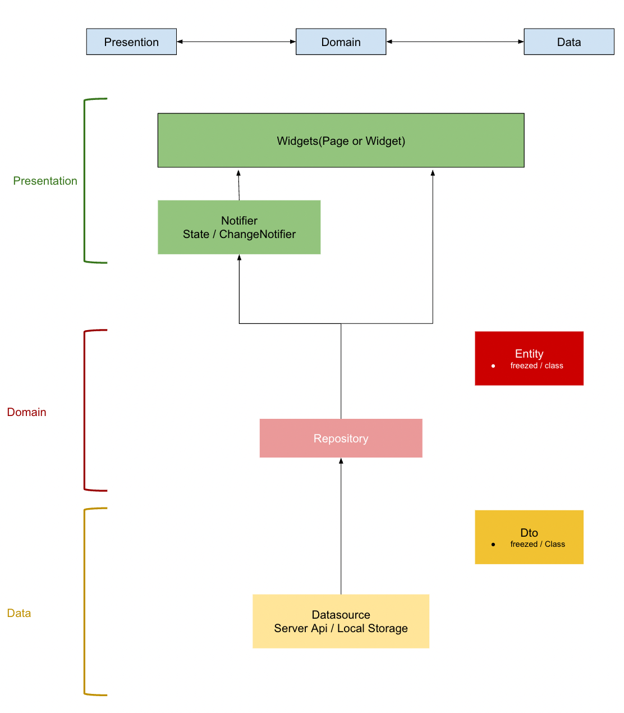

Flutter App demonstrates common pattern of getting data from network, transform data to domain object, and display them in list view, manage state with [riverpod](https://docs-v2.riverpod.dev/).

# Build

Code generation: `dart run build_runner build`
And then you can run it.

PS: you can let build_runner keep watching for code changes: `dart run build_runner watch -d`.

# Features

- Read data from in JSON format with pagination: https://jsonplaceholder.typicode.com/photos
- 2 data sources: remote and local, try local first and if cache missed, read from remote source (also save to local source).
- Pregressive loading: when scroll to last item, load another page of items.
- Pull to reload.
- Tap on item to change item state.

# TODO

- Cache thumbnail images with limit size (to prevent App keep eating storage).

# Architecture

Mostly clean architecture with some homemade simplifications:
.